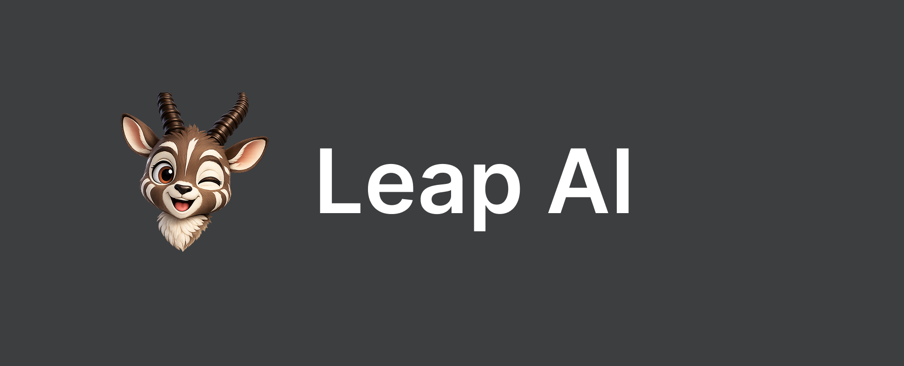
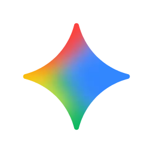

<p align="center">
  
</p>

# Leap AI SDK

<p align="center">
  <a href="https://www.nuget.org/packages/LeapAi.Sdk"></a>
</p>

<p align="center">
  
</p>


The **Leap AI SDK** is a provider-agnostic .NET toolkit designed to help you build AI-powered applications, chatbots, and agents. Built with a highly scalable, enterprise-grade architecture, it provides a unified, stateless service interface to interact with any language model.

**AI Models**
<p align="start">
  
  
  
  
</p>

## Installation

You will need the .NET SDK installed on your local development machine. You can find the package on [NuGet](https://www.nuget.org/packages/LeapAi.Sdk).

```shell
dotnet add package LeapAi.Sdk
```

### Available NuGet Packages
Leap AI SDK v2.0 introduces a modular architecture. You can install the fully-featured metapackage or adopt specifically what you need:
- `LeapAi.SDK`: The all-in-one metapackage containing Core and all official providers.
- `Leap.AI.Core`: The bare-metal abstractions, unified models, and pipeline architecture.
- [`LeapAi.SDK.Providers.OpenAi`](https://www.nuget.org/packages/LeapAi.SDK.Providers.OpenAi/): Official OpenAI adapter (GPT-4o, o3-mini, etc.).
- [`LeapAi.SDK.Providers.Anthropic`](https://www.nuget.org/packages/LeapAi.SDK.Providers.Anthropic/): Official Anthropic adapter (Claude 3.5 / 3.7 Sonnet, etc.).
- [`LeapAi.SDK.Providers.Google`](https://www.nuget.org/packages/LeapAi.SDK.Providers.Google/): Official Google Gemini adapter (Gemini 2.0 Flash, 1.5 Pro, etc.).
- [`LeapAi.SDK.Providers.xAI`](https://www.nuget.org/packages/LeapAi.SDK.Providers.xAI/): Official xAI Grok adapter (Grok-3, Grok-2, etc.).
- [`LeapAi.SDK.Extensions.DependencyInjection`](https://www.nuget.org/packages/LeapAi.SDK.Extensions.DependencyInjection/): Official builder extensions for ASP.NET Core `IServiceCollection` integrations.

## Unified Provider Architecture

Leap AI SDK v2.0 introduces a high-performance **middleware pipeline** architecture designed natively for .NET. It lets you plug in OpenAI, Anthropic, Google Gemini, or xAI Grok and write strictly against a unified, model-agnostic `LeapClient`.

```csharp
using Leap.AI.Core;
using Leap.AI.Providers.OpenAi;
using Leap.AI.Core.Models;

// 1. Build your client pipeline
var leap = LeapClient.Create()
    .UseOpenAi("sk-...", "gpt-4o-mini") // Or .UseAnthropic() / .UseGoogle() / .UseXAi()
    .UseLogging()
    .UseRetry(maxRetries: 3)
    .Build();

// 2. Generate
string result = await leap.GenerateTextAsync("Hello!");
```

---

## Usage

### Generating Text (Chat)

Generating conversational output is clean and simple. You can query models directly with raw strings or conversational histories.

```csharp
var messages = new List<ChatMessage> {
    ChatMessage.System("You are a helpful assistant."),
    ChatMessage.User("What is an agent?")
};

var response = await leap.GenerateAsync(messages);
Console.WriteLine(response.Text);
```

### Streaming Text

The SDK natively leverages Server-Sent Events (SSE) providing an `IAsyncEnumerable<ChatChunk>`. It unifies the varying streaming schemas from Anthropic, Google, and OpenAI under a single interface.

```csharp
await foreach (var chunk in leap.StreamAsync("Count to 3 quickly."))
{
    Console.Write(chunk.Text);
}
```

### Generating Structured Data (JSON)

The `GenerateObjectAsync<T>` method dynamically builds JSON Schema definitions strictly from your C# `record` or `class` definitions, complete with type enforcement, enum mapping, nullable safety, and validation retries.

```csharp
public record Recipe(string Name, int PrepTimeMinutes, List<string> Ingredients);

var recipe = await leap.GenerateObjectAsync<Recipe>(
    "Generate a simple chocolate chip cookie recipe."
);

Console.WriteLine($"Recipe: {recipe.Name} ({recipe.PrepTimeMinutes}m prep)");
```

### Agents & Tool Calling

Leap AI v2.0 includes fully-automated tool calling execution. Just create a `FunctionTool<T>` definition, attach it to your client, and the SDK will automatically manage the round-trip loops required.

```csharp
using Leap.AI.Core.Tools;

public record WeatherArgs(string City);

// 1. Define your tool
var weatherTool = FunctionTool<WeatherArgs>.Create(
    name: "get_weather",
    description: "Gets the current weather for a specific city.",
    handler: args => $"The weather in {args.City} is sunny and 22C."
);

// 2. Register it when building the client
var leap = LeapClient.Create()
    .UseOpenAi("sk-...")
    .UseTool(weatherTool)
    .Build();

// 3. The SDK automatically resolves the tool requests in the background!
var response = await leap.GenerateTextAsync("What's the weather like in Paris?");
```

---

## Community

The Leap AI SDK community can be found on our GitHub repository where you can ask questions, voice ideas, and share your projects with other people.

## Contributing

Contributions to the Leap AI SDK are welcome and highly appreciated. Stay tuned for our Contribution Guidelines to make sure you have a smooth experience contributing!
